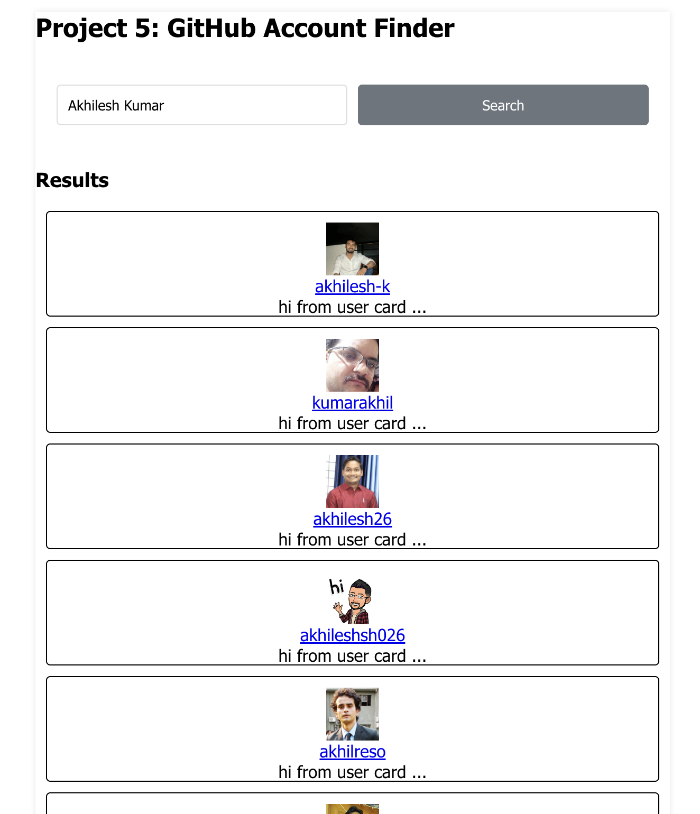

# GitAccountDiscoverer 🕵️‍♂️

Discover GitHub accounts with ease using GitAccountDiscoverer, a sleek and user-friendly React application. This application allows you to search for GitHub users by their username and fetches real-time results directly from the GitHub API.
 &nbsp;&nbsp;

 &nbsp;&nbsp;
## Quick Start 🚀

To get started with GitAccountDiscoverer, follow these steps:

1. **Clone the Repository**: Use the command `git clone [repository_url]` to clone the repository to your local machine.
2. **Install Dependencies**: Navigate to the cloned repository and run `npm install` to install all necessary dependencies.
3. **Run the Application**: Start the application by running `npm start` in your terminal. Once the application is running, open your web browser and navigate to `http://localhost:3000` to start exploring!

## Features 🌟

GitAccountDiscoverer is packed with features designed to enhance your GitHub exploration experience:

- **User-friendly Search**: The application boasts a simple and intuitive user interface that allows for lightning-fast queries.
- **Live Updates**: As you type in the search bar, results appear instantly, providing a seamless user experience.
- **GitHub Magic**: The application integrates seamlessly with the GitHub API, ensuring accurate and up-to-date results.
- **Responsive Design**: Whether you're on a desktop, tablet, or mobile device, GitAccountDiscoverer works smoothly, providing a consistent experience across all devices.

## Usage 🚀

Using GitAccountDiscoverer is as easy as 1-2-3:

1. **Enter a GitHub username** in the search bar.
2. Click the **"Search"** button to fetch and display the corresponding GitHub accounts.
3. **Explore the Results**: Each UserCard provides profile information and links for further exploration.

## Technologies Used 🛠️

GitAccountDiscoverer is built using the following technologies:

- **React**: A JavaScript library for building user interfaces.
- **useState Hook**: A React Hook that lets you add React state to function components.
- **GitHub API**: Provides up-to-date information about GitHub users.

## Project Structure 📂

The project follows a structured organization to enhance readability and maintainability:

- **node_modules/**: This directory is generated automatically by npm (Node Package Manager) when you run `npm install`. It contains all the packages and modules that the project depends on.
- **src/**: The src directory is the heart of the project, housing the source code.
    - **components/**: This directory holds the React components used in the project. Components are modular and reusable pieces of the user interface.
    - **App.js**: The main entry point for the application. It contains the primary logic and structure for rendering the UI components.
    - **App.css**: The stylesheet for styling the components and elements within the App.js file.
- **package.json and package-lock.json**: These files define the project's metadata, including dependencies, version, and scripts. `package-lock.json` provides a more deterministic dependency resolution.

## License 📝

This project is licensed under the MIT License. Happy coding!

## Connect with Me 🌐

Feel free to connect with me on social media:

 &nbsp;&nbsp;

 &nbsp;&nbsp;

Let's stay in touch! 🚀